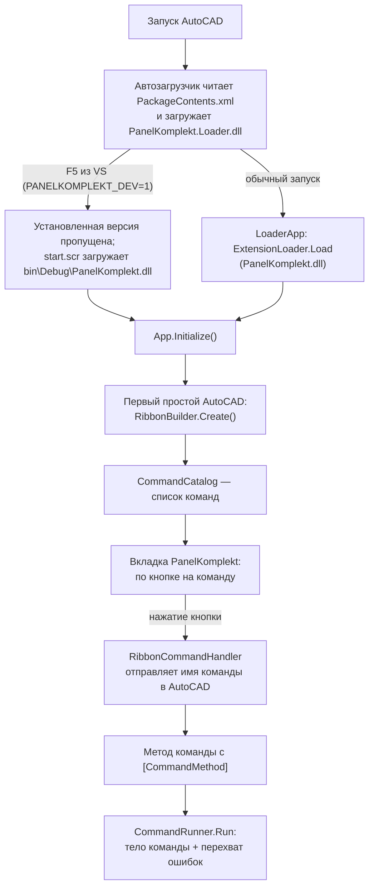

# Структура проекта PanelKomplekt

Плагин AutoCAD 2021 (C#, .NET Framework 4.8, x64). Обновляется при каждом изменении структуры.

## Папки и файлы
```
PanelKomplekt/                         корень репозитория
├── PanelKomplekt.sln                  решение VS 2022
├── AutoCadReferences.props            общие ссылки на библиотеки AutoCAD 2021 (локально или NuGet)
├── README.md                          главная страница: для пользователя и для программиста
├── CHANGELOG.md                       журнал изменений простым языком
├── LICENSE                            закрытый проект, все права защищены
├── CLAUDE.md                          инструкции для Claude (ссылаются на Docs)
├── .editorconfig                      кодировка, отступы, окончания строк
├── .gitignore / .gitattributes        настройки git (dist/ не хранится, *.dwg — двоичные)
├── .github/workflows/build.yml        автосборка на GitHub и релиз по тегу v*
├── Docs/                              документация
│   ├── UserGuide.md                   руководство пользователя AutoCAD
│   ├── DeveloperGuide.md              руководство разработчика
│   ├── DevelopmentRules.md            обязательные правила разработки
│   ├── ProjectStructure.md            этот файл
│   ├── CommandTemplate.md             шаблон описания команды (используется New-Command.ps1)
│   ├── Glossary.md                    словарь терминов
│   └── CustomerQuestions.txt          вопросы заказчику
├── Installer/                         исходники установщика
│   ├── PackageContents.xml            описание пакета для автозагрузчика AutoCAD
│   ├── Install.cmd / Uninstall.cmd    запуск установки / удаления двойным щелчком
│   ├── Install.ps1                    логика установки и удаления
│   └── ReadMe.txt                     краткая инструкция внутри архива
├── tools/                             вспомогательные скрипты
│   ├── New-Command.ps1                заготовка новой команды
│   ├── Build-Bundle.ps1               сборка установочного архива в dist/
│   ├── dump.lsp                       выгрузка содержимого DWG в текст
│   └── dump.scr                       скрипт запуска dump.lsp
├── PanelKomplekt.Loader/              загрузчик установленной версии
│   ├── PanelKomplekt.Loader.csproj
│   └── LoaderApp.cs                   грузит PanelKomplekt.dll; при PANELKOMPLEKT_DEV=1 (отладка) — ничего
└── PanelKomplekt/                     проект плагина
    ├── PanelKomplekt.csproj           версия плагина, подключение AutoCadReferences.props
    ├── start.scr                      NETLOAD собранной DLL при отладке
    ├── Properties/launchSettings.json запуск AutoCAD 2021 по F5 с PANELKOMPLEKT_DEV=1
    ├── App.cs                         точка входа (IExtensionApplication), создание ленты
    ├── Core/                          общий код для всех команд
    │   ├── CommandInfo.cs             описание команды (номер, имя, кнопка)
    │   ├── CommandCatalog.cs          список всех команд — источник кнопок ленты
    │   └── CommandRunner.cs           запуск тела команды с обработкой ошибок
    ├── Ribbon/                        лента
    │   ├── RibbonBuilder.cs           построение вкладки по CommandCatalog
    │   └── RibbonCommandHandler.cs    запуск команды AutoCAD по нажатию кнопки
    └── Commands/                      команды, каждая в своей папке
        ├── C100_About/                PK_C100_ABOUT — версия плагина
        │   ├── C100_About.cs
        │   └── C100_About.md
        └── C101_ShowElementId/        PK_C101_SHOWELEMENTID — ID выбранного элемента
            ├── C101_ShowElementId.cs
            └── C101_ShowElementId.md
```

## Установочный архив
`tools/Build-Bundle.ps1` создаёт `dist/PanelKomplekt-<версия>.zip`:
```
PanelKomplekt-<версия>.zip
├── PanelKomplekt.bundle/
│   ├── PackageContents.xml
│   └── Contents/
│       ├── PanelKomplekt.Loader.dll   загружается AutoCAD при запуске
│       └── PanelKomplekt.dll          основной плагин, загружается загрузчиком
├── Install.cmd
├── Uninstall.cmd
├── Install.ps1
└── ReadMe.txt
```
Установка копирует `PanelKomplekt.bundle` в `C:\Program Files\Autodesk\ApplicationPlugins`.

## Как работает плагин


1. Установленная версия: AutoCAD загружает `PanelKomplekt.Loader.dll`, он загружает `PanelKomplekt.dll`. Отладка (F5): загрузчик пропускает установленную версию, `start.scr` загружает DLL из `bin\Debug`. В обоих случаях вызывается `App.Initialize()`.
2. `App` при первом простое вызывает `RibbonBuilder.Create()`; при смене рабочего пространства — повторно.
3. `RibbonBuilder` берёт список из `CommandCatalog` и создаёт кнопки, сгруппированные по панелям.
4. Нажатие кнопки → `RibbonCommandHandler` отправляет в AutoCAD имя команды (`GlobalName`).
5. AutoCAD вызывает метод с `[CommandMethod]` → тело команды выполняется через `CommandRunner.Run`.

## Команды
| Номер | Имя в AutoCAD | Панель | Назначение | Статус |
|---|---|---|---|---|
| C100 | PK_C100_ABOUT | Сервис | Версия плагина | служебная |
| C101 | PK_C101_SHOWELEMENTID | Сервис | ID выбранного элемента | тестовая |
