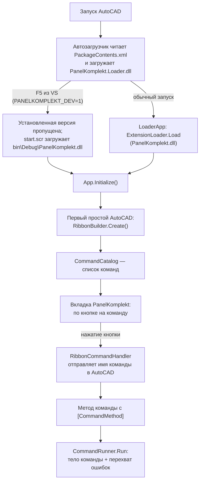

# Структура проекта PanelKomplekt

Плагин AutoCAD 2021 (C#, .NET Framework 4.8, x64). Обновляется при каждом изменении структуры.

## Папки и файлы
```
PanelKomplekt/                         корень репозитория
├── PanelKomplekt.sln                  решение VS 2022
├── AutoCadReferences.props            общие ссылки на библиотеки AutoCAD 2021 (локально или NuGet)
├── README.md                          главная страница: для пользователя и для программиста
├── CHANGELOG.md                       журнал изменений простым языком
├── LICENSE                            закрытый проект, все права защищены
├── CLAUDE.md                          инструкции для Claude (ссылаются на Docs)
├── .editorconfig                      кодировка, отступы, окончания строк
├── .gitignore / .gitattributes        настройки git (dist/ не хранится, *.dwg — двоичные)
├── .github/workflows/build.yml        автосборка на GitHub и релиз по тегу v*
├── Docs/                              документация
│   ├── UserGuide.md                   руководство пользователя: установка, общие правила, список команд
│   ├── Commands/                      инструкции пользователя, по одной странице на команду
│   │   ├── C100_About.md              открываются по F1 с кнопки на ленте (CommandInfo.HelpUrl)
│   │   ├── C101_ShowElementId.md
│   │   ├── C102_PanelCheck.md
│   │   ├── C201_InsertPanel.md
│   │   └── C301_Specification.md
│   ├── DeveloperGuide.md              руководство разработчика
│   ├── DevelopmentRules.md            обязательные правила разработки
│   ├── ProjectStructure.md            этот файл
│   ├── CommandTemplate.md             шаблон описания команды (используется New-Command.ps1)
│   ├── Glossary.md                    словарь терминов
│   └── CustomerQuestions.txt          вопросы заказчику
├── Installer/                         исходники установщика
│   ├── PackageContents.xml            описание пакета для автозагрузчика AutoCAD
│   ├── Install.cmd / Uninstall.cmd    запуск установки / удаления двойным щелчком
│   ├── Install.ps1                    логика установки и удаления
│   └── ReadMe.txt                     краткая инструкция внутри архива
├── tools/                             вспомогательные скрипты
│   ├── New-Command.ps1                заготовка новой команды
│   ├── Generate-Icons.ps1             рисование иконок кнопок ленты (16 и 32 px)
│   ├── Build-Bundle.ps1               сборка установочного архива в dist/
│   ├── dump.lsp                       выгрузка содержимого DWG в текст
│   └── dump.scr                       скрипт запуска dump.lsp
├── PanelKomplekt.Loader/              загрузчик установленной версии
│   ├── PanelKomplekt.Loader.csproj
│   └── LoaderApp.cs                   грузит PanelKomplekt.dll; при PANELKOMPLEKT_DEV=1 (отладка) — ничего
└── PanelKomplekt/                     проект плагина
    ├── PanelKomplekt.csproj           версия плагина, иконки, подключение AutoCadReferences.props
    ├── start.scr                      NETLOAD собранной DLL при отладке
    ├── Properties/launchSettings.json запуск AutoCAD 2021 по F5 с PANELKOMPLEKT_DEV=1
    ├── Blocks/PK_Panel.dwg            файл-шаблон динамического блока панели (копируется в bin\...\Blocks)
    ├── App.cs                         точка входа (IExtensionApplication), создание ленты
    ├── Core/                          общий код для всех команд
    │   ├── CommandInfo.cs             описание команды (номер, имя, кнопка, адрес справки по F1)
    │   ├── CommandCatalog.cs          список всех команд — источник кнопок ленты, адреса справки
    │   ├── CommandRunner.cs           запуск тела команды с обработкой ошибок
    │   ├── PluginLog.cs               журнал ошибок в %LOCALAPPDATA%\PanelKomplekt
    │   ├── IconLoader.cs              загрузка иконок кнопок из ресурсов DLL
    │   ├── PluginInfo.cs              сведения о плагине: версия, заказчик, разработчик, технологии
    │   ├── AcadWindow.cs              главное окно AutoCAD как владелец диалогов (MessageBox, формы)
    │   ├── PanelBlock.cs              блок PK_Panel: имена параметров и атрибутов, добавление в чертёж из шаблона
    │   ├── PanelData.cs               данные одной панели (длина, ширина, марка, тип, цвета, площадь)
    │   ├── PanelReader.cs             распознавание и чтение панелей из чертежа
    │   ├── PanelSettings.cs           настройки новых панелей (ширина, буква, тип, цвета), хранятся в чертеже
    │   ├── PanelInserter.cs           вставка панели из кода: атрибуты, поле длины (?BlockRefId → ID вставки), размеры
    │   ├── PanelFieldRefresher.cs     пересчёт полей в атрибутах одной панели
    │   └── PanelFieldUpdater.cs       фоновое обновление марок после команд (растягивание, копирование, отмена)
    ├── Ribbon/                        лента
    │   ├── RibbonBuilder.cs           построение вкладки по CommandCatalog, подсказки кнопок и справка по F1
    │   └── RibbonCommandHandler.cs    запуск команды AutoCAD по нажатию кнопки
    └── Commands/                      команды, каждая в своей папке
        ├── C100_About/                PK_C100_ABOUT — окно «О плагине»
        │   ├── C100_About.cs
        │   ├── C100_About.md
        │   └── C100_About_16.png / _32.png    иконки кнопки
        ├── C101_ShowElementId/        PK_C101_SHOWELEMENTID — ID выбранного элемента
        │   ├── C101_ShowElementId.cs
        │   ├── C101_ShowElementId.md
        │   └── C101_ShowElementId_16.png / _32.png
        ├── C102_PanelCheck/           PK_C102_PANELCHECK — проверка панелей PK_Panel
        │   ├── C102_PanelCheck.cs
        │   ├── C102_PanelCheck.md
        │   └── C102_PanelCheck_16.png / _32.png
        ├── C201_InsertPanel/          PK_C201_INSERTPANEL — создание панелей
        │   ├── C201_InsertPanel.cs    команда: блок, настройки, выбор режима
        │   ├── ArrayPanelCreator.cs   режим «массив»: форма, три точки, вставка панелей
        │   ├── SinglePanelCreator.cs  режим «по одному»: точки и опции командной строки
        │   ├── PanelPlacement.cs      общее для обоих режимов: поворот, проекция, сохранение настроек
        │   ├── PanelModeForm.cs       окно выбора режима: массив или по одной панели
        │   ├── PanelArrayForm.cs      окно параметров массива: буква, длина, ширина, зазор, тип, цвета
        │   ├── PanelArrayPlanner.cs   расчёт раскладки без AutoCAD: смещения панелей и укороченная последняя
        │   ├── PanelJig.cs            предпросмотр панели при указании конечной точки
        │   ├── C201_InsertPanel.md
        │   └── C201_InsertPanel_16.png / _32.png
        └── C301_Specification/        PK_C301_SPECIFICATION — спецификация панелей
            ├── C301_Specification.cs          команда: выбор панелей, вид результата
            ├── SpecificationModel.cs          модель: группы, строки, итоги, предупреждения
            ├── SpecificationBuilder.cs        расчёт без AutoCAD: группировка, площади, предупреждения
            ├── SpecificationExcelWriter.cs    запись .xlsx (ClosedXML)
            ├── SpecificationTableWriter.cs    таблица AutoCAD в чертеже
            ├── C301_Specification.md
            └── C301_Specification_16.png / _32.png
```

## Установочный архив
`tools/Build-Bundle.ps1` создаёт `dist/PanelKomplekt-<версия>.zip`:
```
PanelKomplekt-<версия>.zip
├── PanelKomplekt.bundle/
│   ├── PackageContents.xml
│   └── Contents/
│       ├── PanelKomplekt.Loader.dll   загружается AutoCAD при запуске
│       ├── PanelKomplekt.dll          основной плагин, загружается загрузчиком
│       ├── ClosedXML.dll, DocumentFormat.OpenXml.dll, ExcelNumberFormat.dll, System.IO.Packaging.dll   выгрузка в Excel
│       └── Blocks/PK_Panel.dwg        файл-шаблон блока панели
├── Install.cmd
├── Uninstall.cmd
├── Install.ps1
└── ReadMe.txt
```
Установка копирует `PanelKomplekt.bundle` в `C:\Program Files\Autodesk\ApplicationPlugins`.

## Как работает плагин


1. Установленная версия: AutoCAD загружает `PanelKomplekt.Loader.dll`, он загружает `PanelKomplekt.dll`. Отладка (F5): загрузчик пропускает установленную версию, `start.scr` загружает DLL из `bin\Debug`. В обоих случаях вызывается `App.Initialize()`.
2. `App` при первом простое вызывает `RibbonBuilder.Create()` (при смене рабочего пространства — повторно) и запускает `PanelFieldUpdater` — фоновое обновление марок панелей во всех чертежах.
3. `RibbonBuilder` берёт список из `CommandCatalog` и создаёт кнопки, сгруппированные по панелям; иконки берёт `IconLoader` по ключу команды (`CommandInfo.Key`). Каждой кнопке назначается своя подсказка `RibbonToolTip` с адресом страницы команды (`CommandInfo.HelpUrl`): по F1 её открывает встроенная справка AutoCAD.
4. Нажатие кнопки → `RibbonCommandHandler` отправляет в AutoCAD имя команды (`GlobalName`).
5. AutoCAD вызывает метод с `[CommandMethod]` → тело команды выполняется через `CommandRunner.Run`.
6. Ошибка внутри команды не доходит до AutoCAD: `CommandRunner` показывает короткое сообщение, а стек вызовов пишет через `PluginLog` в `%LOCALAPPDATA%\PanelKomplekt\PanelKomplekt.log`.

## Команды
| Номер | Имя в AutoCAD | Раздел ленты | Кнопка | Назначение | Статус |
|---|---|---|---|---|---|
| C100 | PK_C100_ABOUT | Сервис | О плагине | Окно «О плагине»: версия, заказчик, разработчик, технологии | служебная |
| C101 | PK_C101_SHOWELEMENTID | Элементы | Поиск | ID выбранного объекта чертежа | рабочая |
| C201 | PK_C201_INSERTPANEL | Панели | Создание | Массив панелей вдоль линии или вставка по одной; фоновое обновление марок | рабочая |
| C102 | PK_C102_PANELCHECK | Панели | Проверка | Проверка панелей: блок PK_Panel в чертеже и данные выбранных панелей | служебная |
| C301 | PK_C301_SPECIFICATION | Спецификации | Составить | Спецификация панелей: Excel и/или таблица в чертеже | рабочая |

## Блок PK_Panel
Динамический блок сэндвич-панели, файл-шаблон `PanelKomplekt/Blocks/PK_Panel.dwg`. Работа с ним в коде — только через `Core/PanelBlock.cs` и `Core/PanelReader.cs`.

| Элемент | Значение |
|---|---|
| Геометрия | Замкнутая полилиния 5980 × 1190 мм, слой 0, свойства «ПоБлоку», базовая точка — левый нижний угол |
| Параметр `Length` | Длина, мм: приращение 10, 10…13600, ручка справа |
| Параметр `Width` | Ширина, мм: приращение 10, 100…2000, ручка сверху |
| `PREFIX` | Буква марки (видимый), по умолчанию `П` |
| `LENGTH_CM` | Длина в см (видимый): поле `Length` × 0.1, точность 0 |
| `TYPE`, `RAL_OUT`, `SURFACE_OUT`, `RAL_IN`, `SURFACE_IN` | Тип и цвета (скрытые), по умолчанию `ПСБ-120`, `3005`, `накатка`, `9003`, `накатка` |
